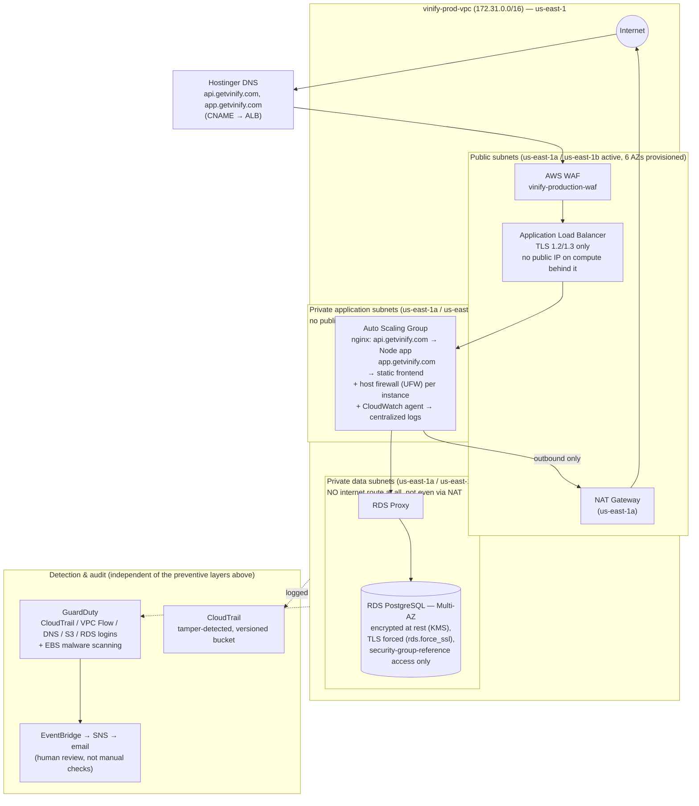

# VINify Network Architecture

Reflects the account as directly verified via the AWS CLI, most recently on 2026-08-07. See [AWS-Security-Setup-Guide.md](AWS-Security-Setup-Guide.md) for the full narrative and baseline procedures behind each piece of this.

## 1. Overview

VINify's production network is a three-tier segmented architecture (public / private-application / private-data) built specifically so that no single control is the only thing standing between the internet and either the application or the database. Every layer described below is independently enforced and has been directly verified against the running account, not just configured and assumed.

## 2. Diagram

## 3. The Tiers

### Public subnets
Host only what genuinely needs to face the internet: the load balancer, the NAT Gateway, and (by deliberate, disclosed decision) one standalone reference instance. No database, no direct path to application data.

### Private application subnets
Run the Auto Scaling Group. No public IP address at all — instances are unreachable from the internet directly, regardless of security group configuration. Outbound access (package installs, GitHub, AWS API calls) goes through the NAT Gateway only; there is no inbound path from the internet.

### Private data subnets
Run RDS. **No internet route exists at all, not even via NAT** — this tier cannot reach the internet and cannot be reached from it, in either direction. The only path in is from the application tier, through RDS Proxy, and only from the specific security group the application tier uses.

## 4. Defense-in-Depth: Six Independent Layers

Each of these is enforced separately — the failure of any one does not remove the others.

| Layer | Controls |
|---|---|
| **Network** | Three-tier segmentation; database tier has no internet route at all; security groups scoped by reference only, never open CIDR; default VPC security group stripped to zero rules |
| **Perimeter** | WAF in front of the load balancer; TLS 1.2/1.3 only enforced at the ALB (no fallback to deprecated protocols); the ALB is the sole ingress point — compute behind it has no public IP |
| **Host** | UFW (host-based firewall) on every instance, independently restricting inbound traffic beyond what the security group already allows |
| **Data** | Encryption at rest (AES-256 via KMS) and in transit (TLS forced at the database level, `rds.force_ssl=1`) — both independent of the network controls above |
| **Identity** | Least-privilege IAM roles scoped to specific named resources/actions (not broad access); no long-lived CI/CD credentials (OIDC federation); MFA enforced on AWS and GitHub |
| **Detection** | GuardDuty continuous anomaly detection + EBS malware scanning, findings auto-routed to a human via EventBridge → SNS → email; tamper-evident CloudTrail; centralized database and server/application logging |

## 5. Traffic Walkthrough — a real request to `app.getvinify.com`

1. DNS resolves to the load balancer (not to any instance's IP — instance IPs are never exposed to clients).
2. WAF inspects the request before it reaches the load balancer's application logic.
3. The ALB terminates TLS (1.2/1.3 only) and forwards the request, plain HTTP, to a healthy target in the private-app subnet.
4. nginx on that instance routes by hostname: `app.getvinify.com` serves the static frontend build directly; `api.getvinify.com` proxies to the Node process, which — if it needs data — connects through RDS Proxy into the private-data subnet, a tier the request itself could never reach directly.
5. Every step is independently logged: the ALB's target, the database connection (identity, source IP, TLS cipher), and the instance's own nginx/application output — all centrally retained, none of it living only on a single ephemeral instance's local disk.

## 6. Known, Disclosed Items

- **NAT egress quirk**: outbound TCP port 22 from the private-app subnets is silently dropped somewhere upstream of the NAT Gateway (confirmed via packet capture — the NAT Gateway itself shows zero drops/errors). Git operations use GitHub's documented SSH-over-443 endpoint instead. Port 443 is unaffected.
- **Certificate**: the load balancer's certificate is an imported (not natively ACM-issued) Let's Encrypt certificate — the domain's DNS is hosted at the registrar rather than Route 53, so ACM's auto-renewal path isn't available yet. See the Security Setup Guide for the expiry date and renewal procedure.
- **Standalone instance**: remains in the public subnet permanently for now, by deliberate decision, serving identical content to the Auto Scaling Group behind the same load balancer.
