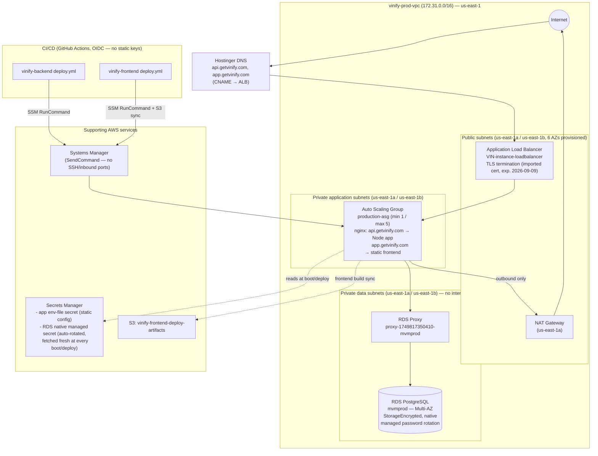

# VINify Production Architecture

Reflects the account as directly verified via the AWS CLI on 2026-08-01, after the network segmentation migration. See [AWS-Security-Setup-Guide.md](AWS-Security-Setup-Guide.md) for the full narrative and baseline procedures behind each piece of this.

## Notes on this diagram

- **NAT egress quirk**: outbound TCP port 22 from the private-app subnets is silently dropped somewhere upstream of the NAT Gateway (confirmed via packet capture; the NAT Gateway itself shows zero drops/errors). Git operations route around it via GitHub's documented SSH-over-443 endpoint instead of the default port 22. Not shown as a separate path above since it uses the same NAT Gateway — only the destination port differs.
- **Certificate risk**: the load balancer's certificate is an imported (not natively ACM-issued) Let's Encrypt certificate, because the domain's DNS is hosted at the registrar (Hostinger) rather than Route 53. It does not auto-renew — see Security Setup Guide, Section 3, for the expiry date and renewal procedure.
